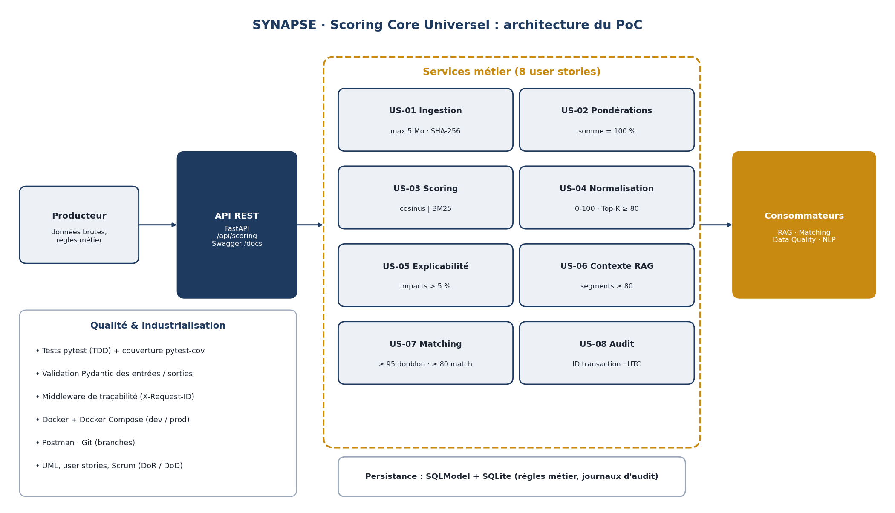
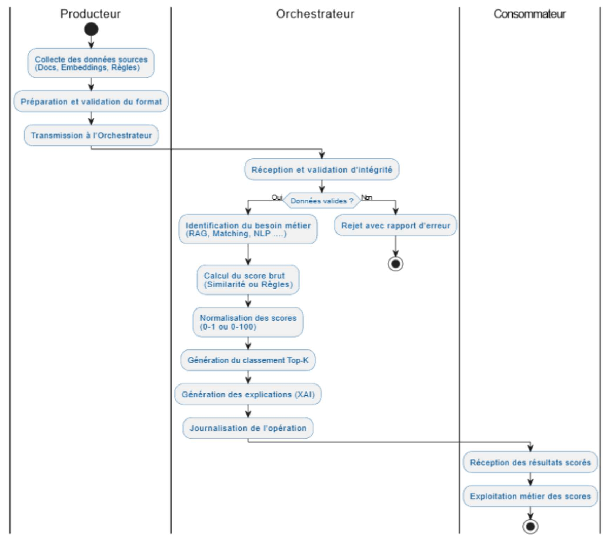
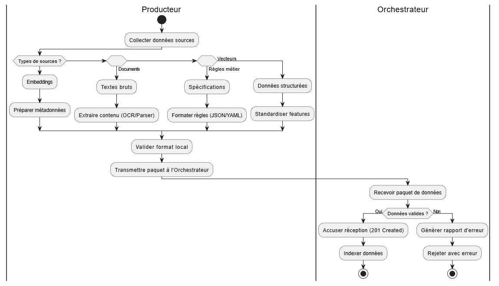
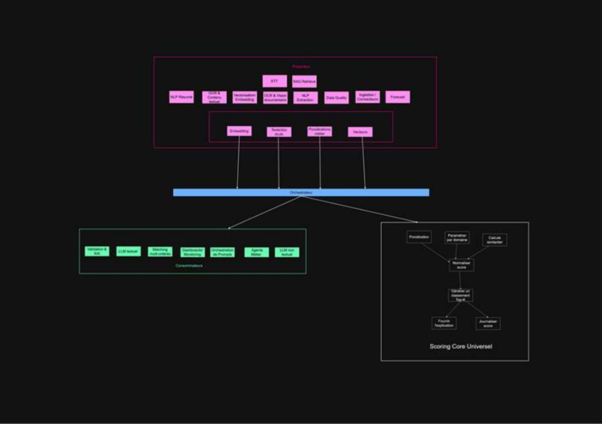
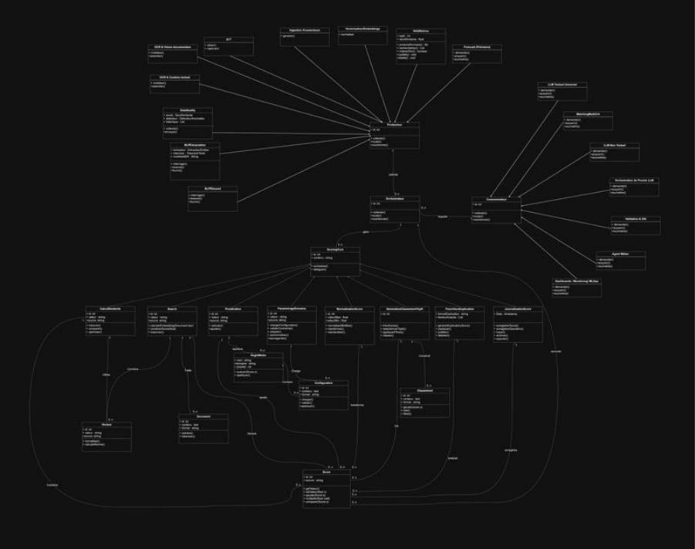
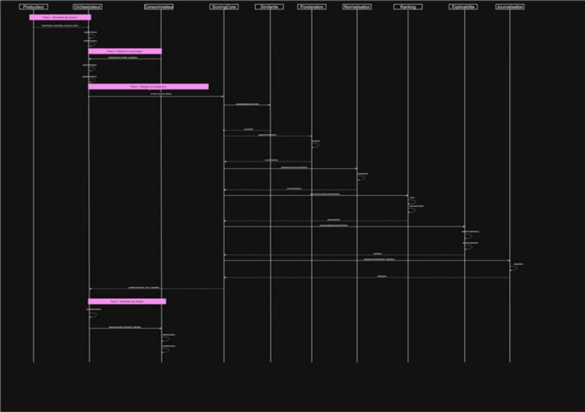

# ⚙️ SYNAPSE · Scoring Core Universel : étude de cas

> Stage de Data Scientist chez **Arimayi**, Paris · novembre 2025 – février 2026.
> 🔒 **Le code source appartient à Arimayi et reste confidentiel.** Ce dépôt présente le besoin, la conception, l'architecture et la démarche, à partir de ma documentation de stage.

## Le contexte

**SYNAPSE** est une plateforme SaaS d'IA multi-secteurs développée par Arimayi : RH, CRM, finance, achats, formation… Chaque module a besoin, à un moment, d'**évaluer la pertinence d'une donnée** : quel CV correspond à cette offre ? quels documents donner au LLM ? ces deux fiches sont-elles des doublons ?

**Ma mission** : concevoir et développer le **Scoring Core Universel**, le moteur centralisé qui calcule, normalise et explique ces scores pour tous les autres modules.

## Le besoin, en trois exigences

1. **Un moteur unique et réutilisable**, appelé par tous les modules, plutôt qu'une logique de scoring recodée dans chacun.
2. **Des règles métier paramétrables** : chaque domaine (RH, Finance, Formation) ajuste ses pondérations sans toucher au code.
3. **Une transparence totale** : chaque score est expliqué (XAI) et chaque opération est tracée, pour la confiance des utilisateurs et la conformité RGPD.

## Ce que j'ai livré : 8 user stories

| US | Fonction | Règle clé |
|---|---|---|
| 01 | Ingestion et validation | Fichiers ≤ 5 Mo, empreinte SHA-256 |
| 02 | Pondérations métier | La somme des poids doit faire 100 % |
| 03 | Calcul du score | Similarité cosinus pour les vecteurs, BM25 pour le texte |
| 04 | Normalisation et Top-K | Échelle 0-100, seuil de pertinence à 80 |
| 05 | Explicabilité (XAI) | Seuls les critères qui pèsent plus de 5 % sont affichés |
| 06 | Contexte pour le RAG | Uniquement les segments fiables, pour limiter les hallucinations du LLM |
| 07 | Matching | ≥ 95 : doublon · ≥ 80 : correspondance pertinente |
| 08 | Audit et traçabilité | Chaque opération journalisée avec un ID et un horodatage UTC |

👉 Détails : [user stories et critères d'acceptation](docs/user_stories.md) · [points d'accès de l'API](docs/api_endpoints.md)

## La démarche

**1. Conception UML.** Avant d'écrire une ligne de code : parcours utilisateur, cas d'utilisation, diagramme de classes, diagrammes d'activité et de séquence. Trois acteurs structurent le système : le **Producteur** (qui fournit les données et les règles), l'**Orchestrateur** (qui calcule) et le **Consommateur** (les modules RAG, Matching, Data Quality qui utilisent les scores).

| Parcours utilisateur | Préparation des données |
|---|---|
|  |  |

**2. Organisation agile.** User stories avec critères d'acceptation, découpage en tâches, backlog Scrum avec définition du prêt et du terminé (DoR / DoD).

**3. Développement de l'API.** FastAPI, architecture en couches (modèles, services, routeurs), validation des données avec Pydantic, persistance avec SQLModel et SQLite, documentation Swagger générée automatiquement.

**4. Qualité.** Tests unitaires et d'intégration avec pytest (approche TDD) et mesure de la couverture du code avec pytest-cov, collection Postman pour simuler des appels réels, middleware qui attribue un identifiant à chaque requête et mesure son temps de traitement, travail sur branches Git.

**5. Conteneurisation.** Le service est empaqueté avec **Docker** (`Dockerfile` sur une image Python allégée) et lancé avec **Docker Compose**, avec des fichiers de configuration séparés pour le développement et la production (`.env.local` / `.env.production`). Le même environnement tourne ainsi à l'identique sur n'importe quelle machine.

**6. Intégration.** Un contrat d'interface (`service.yaml`) décrit comment les autres briques de SYNAPSE appellent le moteur.

<b>Voir les autres diagrammes UML</b>

**Cas d'utilisation**

**Diagramme de classes**

**Diagramme de séquence**

## Résultat

- ✅ **Les 8 user stories sont implémentées** et testées.
- ✅ **API fonctionnelle et conteneurisée** (Docker Compose), testable depuis l'interface Swagger.
- ✅ **Tests d'intégration au vert** avec pytest.
- 📄 Documentation technique, études UML et contrat d'interface livrés, présentés devant jury.

## Limites du PoC

Je tiens à être transparente sur le périmètre de ce prototype :
- C'est un **PoC** : il est conteneurisé avec Docker et exécuté en local, mais pas encore déployé sur un environnement de production.
- Dans la version documentée, **certains calculs sont encore simulés** (scores de similarité, vecteurs d'embedding). Les bibliothèques des vrais calculs sont intégrées au projet (`sentence-transformers`, `rank_bm25`, `scikit-learn`) ; ce qui est pleinement implémenté : l'architecture, le routage des algorithmes, la normalisation, les seuils et règles métier, l'explicabilité et la traçabilité.
- Les traitements sont **synchrones**, ce qui suffit pour un PoC mais demanderait une file d'attente pour de gros volumes.

## Ce que j'ai appris

- **Concevoir avant de coder.** Les diagrammes UML et les user stories ont fixé les règles métier (seuils, pondérations) avant le développement : le code n'a fait que les traduire.
- **L'explicabilité est une fonctionnalité, pas un bonus.** Un score sans justification n'est pas utilisable par une équipe RH ou finance.
- **Déboguer un environnement réel** : incompatibilité du pilote SQLite asynchrone avec Python 3.14 (résolue avec `aiosqlite`), imports circulaires entre modèles (résolus par un `__init__.py` dynamique), tests en erreur 422 à cause de payloads qui ne suivaient plus les modèles Pydantic.

## Stack

Python · FastAPI · Pydantic · SQLModel · SQLite · pytest · pytest-cov · Docker · Docker Compose · Swagger / OpenAPI · Postman · Git · UML · Scrum

---

👩‍💻 **Nosaiba Elkrekshi** · Master 2 Data & IA · [LinkedIn](https://www.linkedin.com/in/nosaiba-elkrekshi) · nosaiba.elkrekshi@gmail.com
